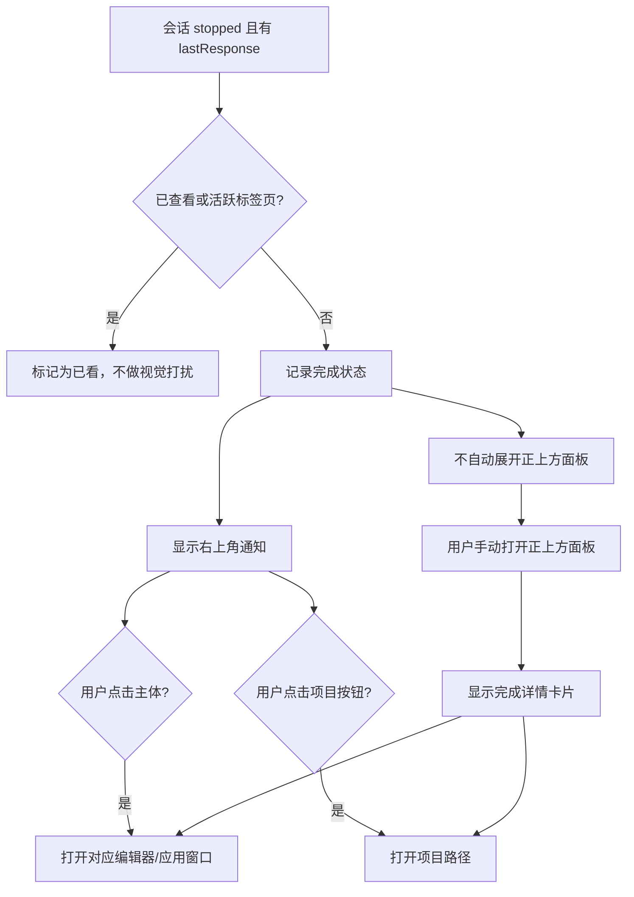

# 任务完成通知改造需求

## 背景

当前任务完成行为会在 Claude/Codex/Cursor 会话停止并带有 `lastResponse` 时，自动展开正上方的效率面板。这个面板会在用户没有主动操作的情况下出现在屏幕顶部，影响用户继续使用当前应用。

本次改造将任务完成反馈改为右上角轻量通知。原有正上方面板继续保留，但只在用户主动触发时打开。

## 目标

1. 将自动出现的任务完成反馈从正上方面板移动到屏幕右上角。
2. 保留现有正上方效率面板和完成详情 UI。
3. 任务完成时不再自动打开正上方面板。
4. 右上角通知和正上方面板里的完成卡片，点击后都打开对应编辑器/应用窗口。
5. 保留原来打开对应项目路径的能力，但改为显式按钮，不再作为默认点击行为。
6. 右上角通知的信息密度需要接近原完成弹窗，不能只显示“任务完成”；必须展示用户问题和 AI 返回内容预览。

## 非目标

1. 本次不重设计权限审批弹窗。
2. 除非视觉通知逻辑必须联动，否则不改变完成提示音行为。
3. 除非新通知状态需要，否则不改变会话轮询间隔或排序规则。
4. 不移除现有正上方面板中的完成预览。
5. 不改变 Codex/Cursor/Claude 会话检测语义。

## 当前行为

当某个会话进入 `stopped` 并且存在 `lastResponse` 时，`Mini.tsx` 会将该会话记录到 `seenCompletions`，设置 `completionSessionId`，并在正上方面板处于折叠状态且对应终端/应用不活跃时调用 `expandFnRef.current?.()`。

结果：

1. mini 窗口自动展开成屏幕正上方的效率面板。
2. 完成弹窗显示在展开后的面板内部。
3. 点击完成弹窗会跳转到对应终端/编辑器/应用。

## 目标行为

当某个会话完成时：

1. 如果用户已经在查看对应会话，继续保持当前的抑制通知行为。
2. 如果该会话需要提醒用户，显示一个紧凑的右上角通知。
3. 不再自动调用 `expand()`。
4. 保留 `completionSessionId` 或等价状态，让用户手动打开正上方面板后仍能看到完成详情。
5. 点击右上角通知，打开对应编辑器/应用窗口。
6. 点击正上方面板里的完成卡片，也打开对应编辑器/应用窗口。
7. 打开项目路径通过两个界面里的独立按钮完成。
8. 完成通知需要明确“这次任务返回了什么”，至少展示一段 AI 回复摘要或原始 `lastResponse` 预览。

## 交互规则

### 右上角完成通知

- 当任务完成且用户没有正在查看相关会话时自动出现。
- 固定在当前显示器的右上角。
- 不抢占焦点。
- 不展开、不移动正上方面板。
- 如果开启了 `autoCloseCompletion`，按配置自动关闭。
- 支持用户手动关闭。
- 点击通知主体打开对应编辑器/应用窗口。
- 点击项目按钮打开项目目录/路径。
- 多个任务连续完成时，优先按最新在上堆叠展示；如果第一版只实现单条通知，则至少用最新通知替换上一条，并确保点击目标是最新会话。
- 信息展示不能过度简化，应包含项目/会话、用户问题、AI 返回预览、来源、时间和状态。
- AI 返回预览优先使用 `lastResponse`，按空间截断；如果 `lastResponse` 是 `"✓"` 这类占位符，则显示来源相关的通用完成说明。

### 通知信息结构

右上角通知应参考原正上方完成弹窗的信息量，但压缩成不挡操作的卡片。建议结构如下：

1. 头部：
   - 头像或当前会话小宠物
   - 项目/会话名称，例如 `桌宠`
   - 来源徽标，例如 `Claude`、`Codex`、`Cursor`
   - 完成时间，例如 `<1m`
   - 状态徽标，例如 `完成`
   - 关闭按钮
2. 用户问题：
   - 显示 `你：<userPrompt>`
   - 单行或两行截断
3. AI 返回预览：
   - 显示 `lastResponse` 的主要内容
   - 支持多行，建议 2 到 4 行
   - 支持 Markdown 的纯文本降级展示，避免在小卡片里渲染过复杂内容
   - 超出内容截断，不展开占满屏幕
4. 操作区：
   - `打开项目`：打开对应 `cwd` 或项目路径
   - `查看编辑器`：打开对应编辑器/终端/应用

推荐尺寸：

- 宽度：约 380 到 460 px
- 高度：约 180 到 260 px，随返回内容略微变化
- 最多展示 4 行返回预览，避免遮挡用户当前工作区

### 正上方效率面板

- 仍由现有主动交互打开，例如点击/悬停 mini 入口。
- 继续展示相关已完成会话的完成详情预览。
- 不因为任务完成而自动打开。
- 点击完成卡片打开对应编辑器/应用窗口。
- 打开项目路径改为显式按钮。

### 会话列表点击

- 对于活跃或已完成的 Claude/Codex/Cursor 行，默认点击行为应继续聚焦于“前往编辑器/应用”。
- 打开项目路径不应作为行点击的隐式兜底行为，应使用显式按钮。
- 标题重命名交互必须继续阻止事件冒泡，不能触发导航。
- 删除按钮必须继续阻止事件冒泡，并且只删除/忽略该会话。

## 原型图

### 右上角通知

```text
屏幕
┌────────────────────────────────────────────────────────────────────────────┐
│                                          ┌──────────────────────────────┐  │
│                                          │ 头像  桌宠  Codex  <1m   X  │  │
│                                          │                     ✓ 完成   │  │
│                                          │ 你：把任务完成提示改到右上角 │  │
│                                          │ ┌──────────────────────────┐ │  │
│                                          │ │ 已完成：新增右上角通知； │ │  │
│                                          │ │ 保留正上方面板手动打开； │ │  │
│                                          │ │ 点击通知打开对应编辑器。 │ │  │
│                                          │ └──────────────────────────┘ │  │
│                                          │ [打开项目]      [查看编辑器] │  │
│                                          └──────────────────────────────┘  │
│                                                                            │
│                         用户继续在这里工作                                 │
│                                                                            │
└────────────────────────────────────────────────────────────────────────────┘
```

点击通知主体：

```text
┌────────────────────────────┐
│ 桌宠  Codex  完成          │  -> 打开 Codex / Cursor / Claude 终端或应用
│ 你：把任务完成提示改到右上角 │
│ 已完成：新增右上角通知；     │
│ 保留正上方面板手动打开。     │
│ [打开项目]      [查看编辑器] │
└────────────────────────────┘
```

点击项目按钮：

```text
┌────────────────────────────┐
│ 桌宠  Codex  完成          │
│ 你：把任务完成提示改到右上角 │
│ 已完成：新增右上角通知...    │
│ [打开项目]      [查看编辑器] │  -> 打开 cwd / 项目路径
└────────────────────────────┘
```

### 视觉原型要求

右上角通知应做成接近真实产品截图的高保真 UI，而不是抽象线框。视觉上参考当前正上方黑色面板：

- 黑色或深色半透明背景
- 8 到 14 px 圆角
- 低对比描边
- 来源使用彩色 pill 徽标
- 用户问题和返回内容使用不同层级颜色
- 操作按钮清晰可点
- 整体不应比原正上方面板更吵，但信息要足够完整

### 用户手动打开的正上方面板

```text
                ┌──────────────────────────────────────────────┐
                │  会话                                        │
                │ ┌──────────────────────────────────────────┐ │
                │ │ Codex  桌宠                    完成      │ │
                │ │ 你: 修改完成提示位置                     │ │
                │ │                                          │ │
                │ │ 已完成。点击卡片打开对应编辑器窗口。       │ │
                │ │                         [打开项目] [X]   │ │
                │ └──────────────────────────────────────────┘ │
                └──────────────────────────────────────────────┘
```

### 事件流程



## 建议实现说明

### 前端

可能涉及文件：

- `frontend/src/Mini.tsx`
- `frontend/src/App.tsx`
- 可选新增组件：`frontend/src/components/CompletionToast.tsx`
- 可选新增窗口路由，例如在 `App.tsx` 中支持 `index.html#/completion-toast`

建议改动：

1. 在 `Mini.tsx` 中抽出导航辅助函数：
   - `openSessionEditor(session)`
   - `openSessionProject(session)`
2. 将完成自动展开逻辑替换为通知状态：
   - 保留 `seenCompletions`
   - 保留完成详情状态
   - 移除已完成会话触发的自动 `expandFnRef.current?.()`
3. 新增右上角通知界面：
   - 推荐方案：使用独立 Tauri 窗口，才能真正定位到屏幕右上角
   - 兜底方案：如果独立窗口风险过高，可先渲染在 mini 窗口内，但这无法真正到达屏幕右上角
4. 更新正上方面板的完成卡片：
   - 主体点击调用 `openSessionEditor`
   - 增加显式“打开项目”按钮，调用 `openSessionProject`
5. 保持事件冒泡边界：
   - 按钮必须调用 `e.stopPropagation()`
   - 标题重命名不能触发编辑器导航
   - 删除/忽略按钮不能触发编辑器导航

### Tauri / Rust

可能涉及文件：

- `frontend/src-tauri/src/lib.rs`

建议改动：

1. 新增一个显式打开会话项目路径的命令，例如：
   - `open_claude_session_project(session_id)`
2. 该命令应该：
   - 根据 ID 查找会话
   - 读取 `cwd`
   - 使用平台原生方式打开 `cwd`
   - 如果 `cwd` 缺失，返回清晰错误
3. 让 `jump_to_claude_terminal` 专注于激活编辑器/应用，不再依赖打开项目文件夹作为主要兜底路径。
4. 如果实现独立通知窗口，可增加类似命令：
   - `show_completion_notification(payload)`
   - `hide_completion_notification(session_id)`
   - 或创建/重定位 `completion-toast` webview 窗口，并通过事件向其发送数据。

### 窗口行为

当前完成弹窗渲染在 `mini` 窗口内部。因为 CSS 无法绘制到原生窗口边界之外，所以如果要真正移动到屏幕右上角，需要新增独立 Tauri 窗口。

通知窗口应该：

- 无边框
- 透明背景
- 置顶
- 避免抢焦点
- 尽量定位在 mini 窗口所在的同一显示器
- 如果无法解析 mini 窗口所在显示器，则回退到主显示器

## 文案

建议标签：

- 状态徽标：`完成`
- 主体兜底文案：
  - Codex：`Codex 已完成任务`
  - Cursor：`Cursor 已完成任务`
  - Claude：`Claude 已完成任务`
- 主操作隐式表达：点击卡片打开编辑器/应用
- 项目按钮：`项目`
- 关闭按钮提示：`关闭`

通知需要保持紧凑，避免在 UI 中写过长说明。

## 边界情况

1. Codex/Cursor 的兜底完成内容可能是 `"✓"`。
   - 展示通用完成消息，不展示 Markdown 预览。
2. `cwd` 为空。
   - 隐藏或禁用项目按钮。
3. 会话来源是 Cursor。
   - 使用 `focus_cursor_terminal`。
4. 会话来源是 Codex。
   - 使用 `jump_to_claude_terminal`，它当前会优先激活 Codex。
5. 会话来源是 Claude Desktop。
   - 使用现有 `jump_to_claude_terminal` 行为。
6. 多个会话短时间内连续完成。
   - 优先支持最多 3 条的小堆叠。
   - 如果只实现单条通知，则最新完成通知替换旧通知。
7. 设置、更新、引导弹窗正在打开。
   - 不自动展开正上方面板。
   - 通知可以继续显示，除非它和模态界面明显冲突。
8. 全屏应用隐藏逻辑正在生效。
   - 避免强制显示 mini 面板。
   - 通知窗口需要单独检查，因为置顶窗口可能与全屏空间冲突。
9. 开启 `autoCloseCompletion`。
   - 对右上角通知和面板完成状态保持一致的自动关闭行为。
10. 用户关闭通知后再手动打开正上方面板。
   - 已完成会话仍应出现在列表中；如果用户明确关闭了完成详情，则详情卡片可以不再展开。

## 验收标准

### 完成通知

- 当 Claude/Codex/Cursor 任务完成且用户没有正在查看对应会话时，右上角通知出现。
- 任务完成时正上方效率面板不会自动打开。
- 通知不抢占当前应用焦点。
- 通知展示项目/会话名称、来源、完成时间、完成状态、用户问题和 AI 返回预览。
- AI 返回预览来自 `lastResponse`，内容过长时按行数和高度截断。
- 当 `lastResponse` 是 `"✓"` 或空内容占位时，通知展示对应来源的通用完成说明。
- 点击通知主体会打开对应编辑器/应用窗口。
- 点击通知关闭按钮只关闭该通知。
- 当 `cwd` 存在时，点击通知中的项目按钮会打开对应项目路径。
- 当 `cwd` 缺失时，项目按钮隐藏或禁用。

### 正上方面板

- 手动打开正上方面板仍然可用。
- 已完成会话仍能在正上方面板中展示完成详情卡片。
- 正上方面板中的完成详情继续展示用户问题和 AI 返回预览，不降级成简单“完成”提示。
- 点击完成卡片会打开对应编辑器/应用窗口。
- 正上方面板的完成卡片包含独立项目按钮。
- 点击项目按钮不会同时触发卡片的“打开编辑器/应用”动作。
- 现有权限审批弹窗行为不变。

### 会话列表

- 会话排序保持不变。
- 等待处理的会话仍然优先于已完成会话。
- 重命名、删除、统计/详情等交互仍然正确阻止事件冒泡。
- Cursor 会话仍然不显示权限弹窗。

### 声音和设置

- 现有完成提示音设置继续生效。
- `autoCloseCompletion` 仍会在配置时间后关闭完成 UI。
- 关闭某类来源后，该来源不再影响通知。

### 平台检查

- macOS：
  - 通知出现在当前显示器右上角。
  - 点击通知能按来源打开 Codex/Cursor/Claude/Ghostty。
  - 通知不会触发正上方面板。
- Windows：
  - 现有 Codex 不支持逻辑继续被尊重。
  - 通知定位正确处理显示器 DPI。
  - Claude Desktop 激活行为保持不变。

## 手动测试计划

1. 以 coding mode 启动应用。
2. 在相关终端标签页不活跃时触发一次 Claude Code 完成。
3. 确认只出现右上角通知。
4. 点击通知主体，确认相关终端/应用获得焦点。
5. 再触发一次完成，点击 `项目`，确认项目路径被打开。
6. 手动打开正上方面板。
7. 确认已完成会话详情存在，并且此前没有被自动打开。
8. 点击正上方面板里的完成卡片，确认编辑器/应用获得焦点。
9. 点击正上方面板里的 `项目` 按钮，确认项目路径打开，且没有触发卡片点击。
10. 触发一次 Cursor 完成，确认聚焦到正确 Cursor 窗口。
11. 触发一次 Codex 完成，确认打开 Codex，而不是先闪一下终端。
12. 开启 `autoCloseCompletion`，触发完成，确认通知按配置自动关闭。
13. 确认等待/权限弹窗行为仍和原来一致。

## 实现风险

1. 真正的右上角通知大概率需要第二个 Tauri webview 窗口。
2. macOS 置顶窗口和全屏 Spaces 的行为可能与普通桌面窗口不同。
3. 同时复用 `jump_to_claude_terminal` 做编辑器激活和项目兜底会让职责混在一起；单独新增项目打开命令更稳。
4. 当前完成状态同时承担了面板可见性职责，建议拆成：
   - 通知可见性
   - 当前完成详情
   - 已查看/已关闭完成记录
5. 多显示器定位需要在 mini 窗口位于非主显示器时重点测试。
